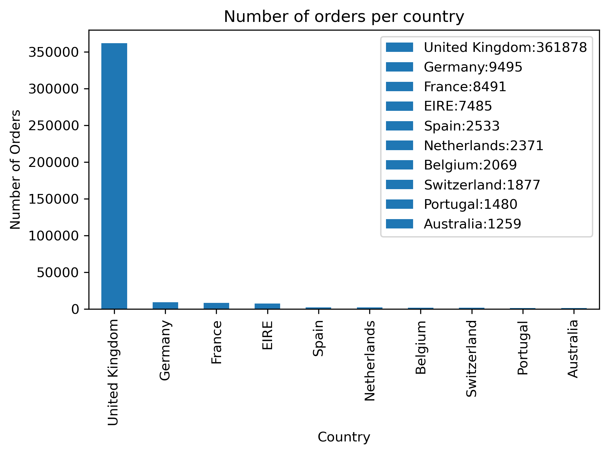
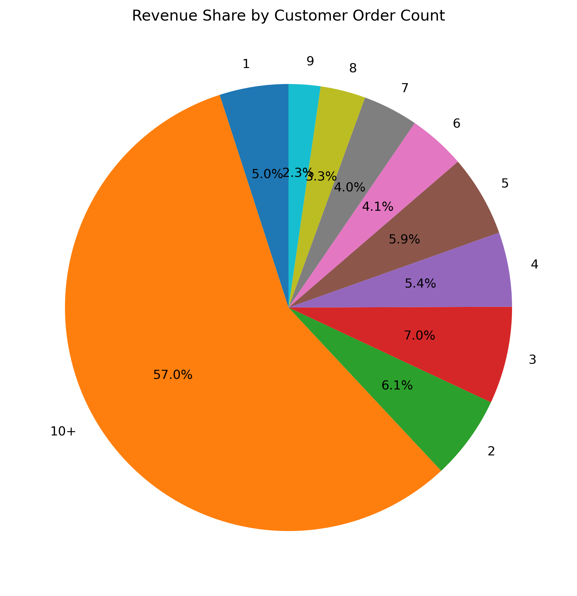
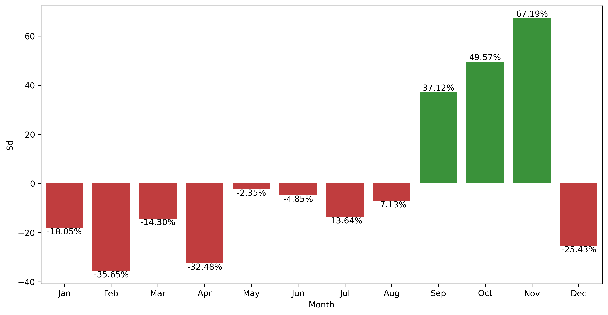
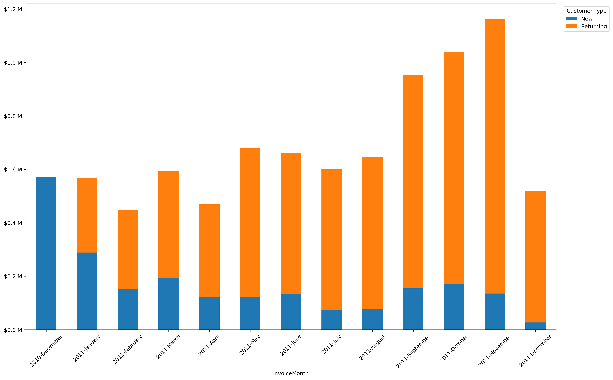
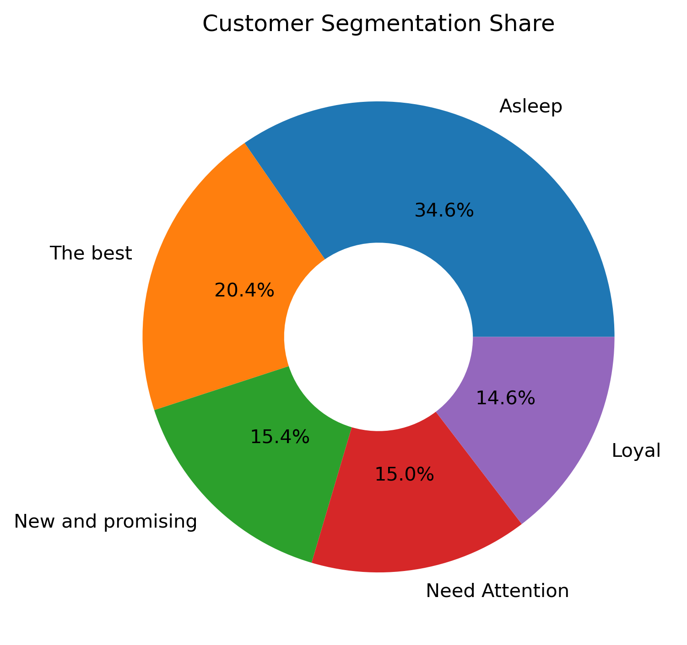

***

# E-Commerce Customer & Sales Data Analysis 

## About the Project
This repository contains a comprehensive analysis of e-commerce data. The project is divided into five logical stages (Jupyter Notebooks) that take us from cleaning raw data to advanced RFM customer segmentation and cohort analysis. The main analytical goal is to understand customer purchasing behaviors, identify seasonal patterns, and highlight the most valuable audience segments, providing a solid foundation for strategic business decisions.

---

## Analysis Structure & Key Insights

### 1. Exploratory Data Analysis (EDA) and Data Cleaning 
**File:** `1_EDA_and_Data_Cleaning.ipynb`

The first stage focuses on preparing a solid foundation for further analysis. 
* **Scope of work:** Loaded the raw data, evaluated its quality, and handled missing values. A new `Revenue` column was created by multiplying Quantity by UnitPrice, strictly filtering out cancelled or negative transactions. 
* **Business Insights:** Properly filtering out negative data (cancellations) prevents distorted revenue figures, allowing for a more accurate assessment of business profitability. The resulting `data_frame.pkl` serves as a trusted single source of truth for the subsequent notebooks.

>  ** Revenue Distribution by Country **
> 

---

### 2. Product and Customer Insights 
**File:** `2_Product_and_Customer_Insights.ipynb`

In this notebook, we take a closer look at order values and the structure of the customer base itself.
* **Scope of work:** Calculated the Average Order Value (AOV), which stands at **$401.60**. We also investigated which customers and cart sizes drive the most revenue.
* **Business Insights:** The analysis groups customers by order count (e.g., 1 to "10+" orders) to evaluate revenue share. Understanding the percentage of revenue generated by one-time buyers versus loyal "veterans" allows for better targeting in marketing campaigns, such as focusing on cross-selling to single-purchase customers.

> 📊 **[Chart Placeholder: Pie Chart - "Revenue Share by Customer Order Count"]**
> *(This chart perfectly highlights the Pareto principle, showing which loyalty tier delivers the most cash to the business)*
> 

---

### 3. Time Series and Seasonality 
**File:** `3_Time_Series_and_Seasonality.ipynb`

This notebook examines customer behavior over time, with a specific focus on the year 2011.
* **Scope of work:** Data was aggregated by time dimensions to evaluate revenue trends. We calculated the percentage deviation (`Sd`) of specific periods from the average performance.
* **Business Insights:** The analysis reveals distinct seasonality and significant revenue fluctuations. The highest revenues occur in the autumn months, with a massive peak in November right before the holiday season. This knowledge is critical for optimizing inventory levels and allocating marketing budgets during the most lucrative times of the year.

> 📊**[Chart Placeholder: Barplot - "Percentage Deviation of Revenue from the Mean in 2011"]**
>  

---

### 4. Cohort Analysis and Retention 🔄
**File:** `4_Cohort_Analysis_and_Retention.ipynb`

A crucial stage to evaluate how long a customer stays with the company and the value they bring throughout their lifecycle.
* **Scope of work:** Assigned customers to cohorts based on their first transaction month. We calculated "Tenure" (the customer's lifespan from their first to their last purchase, expressed in days) and evaluated their total revenue.
* **Business Insights:** Observing Customer Lifetime Value (CLV) in relation to Tenure provides invaluable knowledge. Customers with a longer tenure tend to generate significantly more revenue. This proves that building long-term relationships with existing customers is highly profitable compared to solely focusing on acquiring new ones.

>  **New and Returning customers in Revenue**
>  

---

### 5. RFM Customer Segmentation 
**File:** `5_RFM_Customer_Segmentation.ipynb`

The culmination of the project is the advanced RFM (Recency, Frequency, Monetary) segmentation.
* **Scope of work:** Every customer received R, F, and M scores based on quartiles. They were then classified into 5 intuitive segments: *"The best"*, *"Loyal"*, *"New and promising"*, *"Need Attention"*, and *"Asleep"*.
* **Business Insights:** The highest-tier group (*The best*) generated the absolute majority of the revenue (over **$5.18 million**), despite not making up the largest portion of the base! Conversely, the most numerous group consists of inactive customers (*Asleep* - 1,513 people), who brought in only ~$726k. This precise division is a powerful tool:
    * VIP programs should be directed at the *"The best"* and *"Loyal"* groups.
    * The *"Need Attention"* group requires immediate discount campaigns to prevent churn.

>  **[Chart Placeholder: Pie Chart - "Customer Segmentation Share"]**
> *(A Pie Chart showing what percentage of the customer base falls into each profile bucket, serving as a fantastic analytical summary for stakeholders)*
> 

---

## Summary & Recommendations
The conducted analysis provides a clear picture of the business structure. The operational strategy should currently focus on maximizing profits from the *"The best"* and *"Loyal"* groups, improving the retention rate of one-time buyers, and preemptively building up inventory for the peak Q4 months.

*Built as a portfolio project to demonstrate hands-on experience with Python data analysis and business problem-solving. It serves as a showcase of the technical and analytical foundation I am ready to bring to a Data Analyst Intern role*
